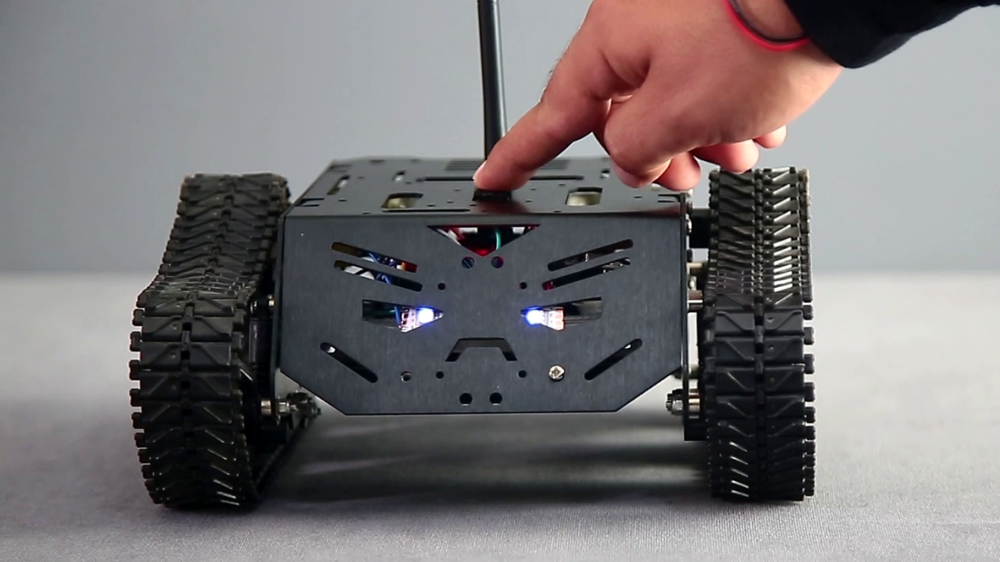
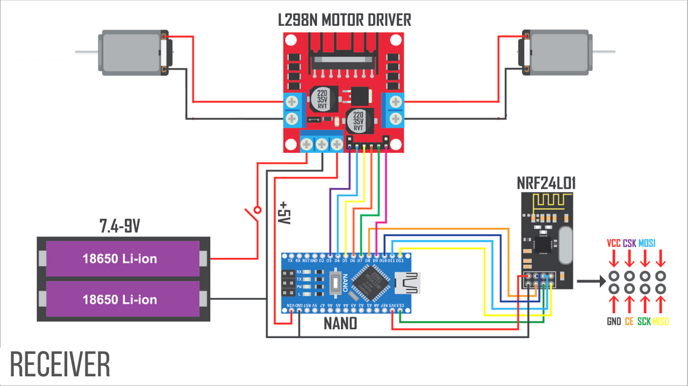
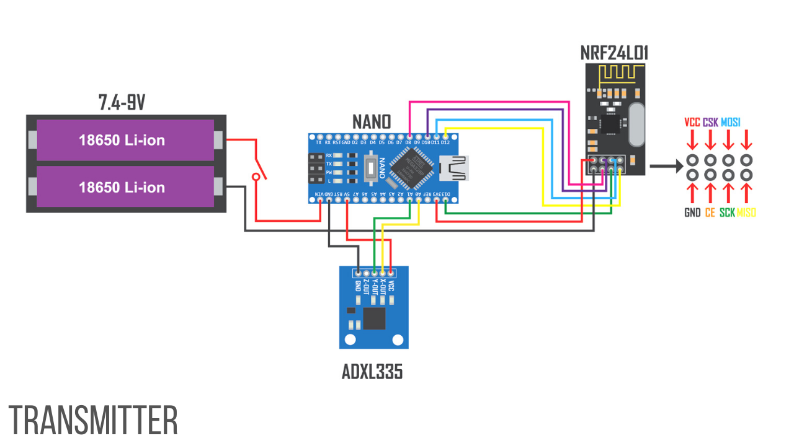

# How To Make DIY Arduino Gesture Control Robot At Home
In this project I am going to show you how to make a DIY Arduino Gesture Control Robot.    
    
# Video Tutorial
  
Please subscribe ❤️ For all lovers of #ArduinoGestureRobot #ArduinoProjects #ArduinoRobot    
# Parts Required for Receiver
1) Robot Tank Chassis - https://bit.ly/3j8y2Q5  
2) Arduino Nano V3 - http://bit.ly/2MHVDYi  
3) L298N Motor Driver - https://bit.ly/369zBJJ  
4) NRF24L01+ Antenna Module - https://bit.ly/3ies6Uw  
5) Adapter For NRF24L01 - https://bit.ly/30cFJgw  
6) 3.7v 18650 Li-ion Battery(x2) - https://bit.ly/2ECGb01  
7) 18650 Battery Holder - https://bit.ly/30cqwMJ  
8) Breadboard - http://bit.ly/30ckFoc  
# Parts Required for Transmitter
1) Get the PCB Board -  
2) Arduino Pro Mini 3.3v 8MHz - https://bit.ly/2GawAy6  
3) NRF24L01+ RF Module - https://bit.ly/3je3v3u  
4) GY-61 ADXL335 Accelerometer - https://bit.ly/2EC4jQq  
5) FT232RL FTDI USB To TTL - http://bit.ly/2RL89st  
6) 3.7v 750mah Lipo Battery - https://bit.ly/2ECTdL7  
7) Self-locking On / Off Switch - https://bit.ly/3cyEtJL  
8) LED Kit - http://bit.ly/37OajhS  
9) Lipo Connector Pin - https://bit.ly/2S3dIUi  
10) 100uF / 10uF Capacitor - http://bit.ly/2s6Sonz  
11) Resistor - http://bit.ly/2lJhi8Z  
12) Female Header Pin - http://bit.ly/2MJtnVm  
13) Soldering Tool Kit - http://bit.ly/2D6YbuC  
# Schematic
    
    
# Get the PCB Board:
(If you want to buy the same PCB which one I used in this project. Just download the Gerber file and upload it to https://www.pcbway.com/ to order the PCB board.)   
$0 For New members first order & Low Price for PCB Stencil at https://www.pcbway.com/    
👉🏻   
😊 Contact Me: https://www.instagram.com/mertarduino
